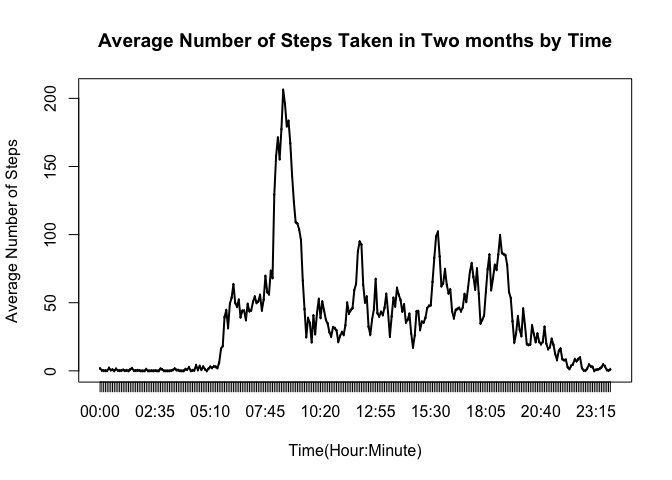

# Reproducible Research: Peer Assessment 1
Feb 1, 2016  

The goal of this project is to practice literal programming. The data used in 
the project contain a person's activity in a two-month period collected by an 
activity monitoring device.

## A. Loading and pre-processing the data
Let's first load the data file and have a look at the data structure:


```r
library(knitr)
library(markdown)
dt <- read.csv("activity.csv")
str(dt)
```

```
## 'data.frame':	17568 obs. of  3 variables:
##  $ steps   : int  NA NA NA NA NA NA NA NA NA NA ...
##  $ date    : Factor w/ 61 levels "2012-10-01","2012-10-02",..: 1 1 1 1 1 1 1 1 1 1 ...
##  $ interval: int  0 5 10 15 20 25 30 35 40 45 ...
```

We see the variable "date" is in character format and needs to be changed to 
date format. Also a variable "time"  needs to be generated from the variable "interval" so we can plot the data in a natural time series, e.g., hour:minute. 


```r
dt[,"date"] <- as.Date(dt[, "date"])
dt$time <- paste(dt$interval%/%1000, 
                 (dt$interval%/%100)-(dt$interval%/%1000)*10,":", 
                 (dt$interval-(dt$interval%/%100)*100)%/%10, 
                 (dt$interval-(dt$interval%/%100)*100)%%10, sep = "")
```

## B. What is the pattern of numbers of steps taken per day?
We first ask several questions to get an overlook on the subject's daily 
activity from this dataset. 

1. what is the total number of steps taken per day?
A histogram is used to answer this question.


```r
totalB <- tapply(dt$steps, dt$date, sum, na.rm = TRUE)
hist(totalB, col = "grey", xlab = "Total number of steps taken per day",
     main = "Frequency of total number of steps taken per day")
```


2. what are the mean and median numbers of steps taken per day?


```r
averageB <- tapply(dt$steps, dt$date, mean, na.rm = TRUE)
medianB <- tapply(dt$steps, dt$date, median, na.rm = TRUE)

plotB2 <- barplot(averageB, space = 0.5, names.arg = rownames(averageB), 
        xlab = "Date", ylab = "Mean Number of Steps", 
        main = "Average Number of Steps taken dailly")
abline(h=0, lwd = 1)
```


```r
plotB3 <- barplot(medianB, space = 0.5, names.arg = rownames(medianB), 
        xlab = "Date", ylab = "Median Number of Steps", 
        main = "Median Number of Steps taken dailly")
abline(h=0, lwd = 1)
```


## C. What is the average daily activity pattern?
1. Make a time series plot of the 5-minute interval (x-axis) and the average number of steps taken, averaged across all days (y-axis).


```r
averageC <- tapply(dt$steps, dt$time, mean, na.rm = TRUE)

plot(averageC ~ as.factor(rownames(averageC)), xlab = "Time(Hour:Minute)", 
     ylab = "Average Number of Steps", 
     main = "Average Number of Steps Taken in Two months by Time")
lines(averageC, lwd = 2)
```



2. Which 5-minute interval, on average across all the days in the dataset,  contains the maximum number of steps?


```r
maxC <- max(averageC)
```


```r
for (i in 1:nrow(averageC)) {
  if (averageC[i] == maxC) {
    timeC <- names(averageC[i])
    }
}
```

The 5-minute interval at 08:35 has the maximum number of steps - 206.1698113.

## D. Imputing missing values
1. Calculate and report the total number of missing values in the dataset


```r
NAstep <- sum(is.na(dt$steps))
NAdate <- sum(is.na(dt$date))
NAinterval <- sum(is.na(dt$interval))
```

There are 2304 NAs in the "steps" column, 0 and 0 
in the "date" and "interval" columns.

2. Devise a strategy for filling in all of the missing values in the dataset.
3. Create a new dataset that is equal to the original dataset but with the missing data filled in.


```r
stepD <- dt$steps
stepDM <- matrix(stepD, nrow = 288,ncol = 61)
for (i in 1:288) {
averageD <- mean(na.omit(stepDM[i, ])); print (averageD)
  for (j in 1:61) {
    if (is.na(stepDM[i, j])) {
  stepDM[i, j] <- averageD
    }
  }
}
stepDV <- c(stepDM)
dt2 <- dt
dt2$steps <- stepDV
```

4. Make a histogram of the total number of steps taken each day. Calculate and report the mean and median total number of steps taken per day.


```r
totalD <- tapply(dt2$steps, dt2$date, sum)

hist(totalD, col = "grey", xlab = "Total number of steps taken per day",
     main = "Frequency of Total Number of Steps Taken Daily after Imputing")
```


```r
averageD <- tapply(dt2$steps, dt2$date, mean)
medianD <- tapply(dt2$steps, dt2$date, median)

plotD2 <- barplot(averageD, space = 0.5, names.arg = rownames(averageD), 
        xlab = "Date", ylab = "Mean Number of Steps", 
        main = "Average Number of Steps Taken Daily after Imputing")
abline(h=0, lwd = 1)
```


```r
plotD3 <- barplot(medianD, space = 0.5, names.arg = rownames(medianD), 
        xlab = "Date", ylab = "Median Number of Steps", 
        main = "Median Number of Steps Taken Daily after Imputing")
abline(h=0, lwd = 1)
```


After imputing of missing values, we see the numbers of total, mean and median steps from the new dataset are different from those from the original dataset.

The frequency of the number of total daily steps between 0-5000 is much lower from the imputed dataset than that from the original dataset.

## E. Are there differences in activity patterns between weekdays and weekends?
1. Create a new factor variable in the dataset with two levels – “weekday” and “weekend” indicating whether a given date is a weekday or weekend day.


```r
dt2$daytype <- ifelse(weekdays(dt2$date) == "Saturday" | weekdays(dt2$date) == "Sunday", "weekend", "weekday")
dt2$daytype <- as.factor(dt2$daytype)
```

2. Make a panel plot containing a time series plot of the 5-minute interval (x-axis) and the average number of steps taken across all weekdays or weekends (y-axis).


```r
library(lattice)
averageE <- aggregate(steps ~ time + daytype, data = dt2, mean)
averageE$time <- as.factor(averageE$time)

xyplot(steps ~ time | daytype, data = averageE, type = "l", layout = c(1, 2))
```


From the plotting results, we see the subject has a higher average number of steps taken and a right shift of active movements over weekends, suggesting the subject get up / go to bed late with more active activities on weekends. 
